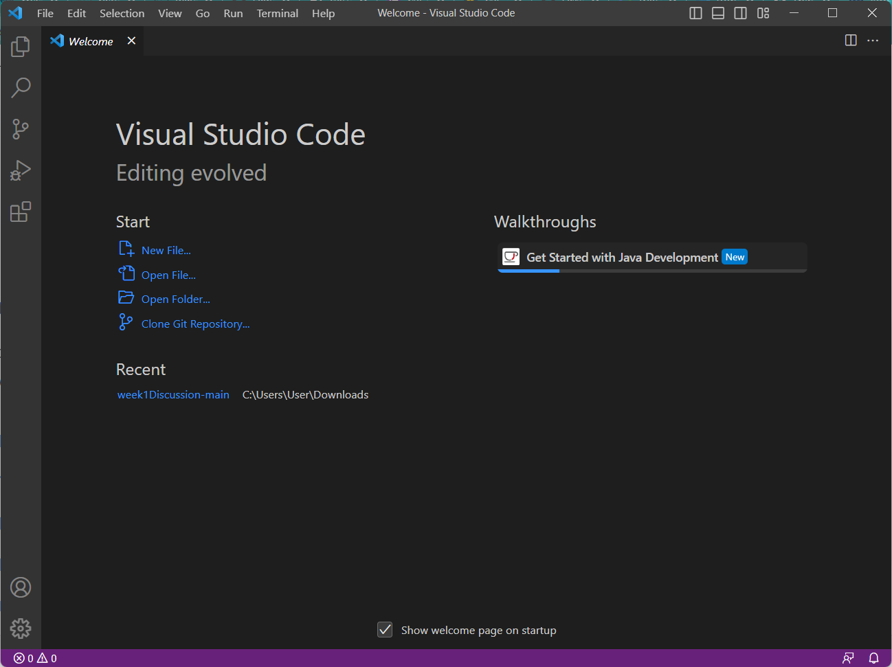
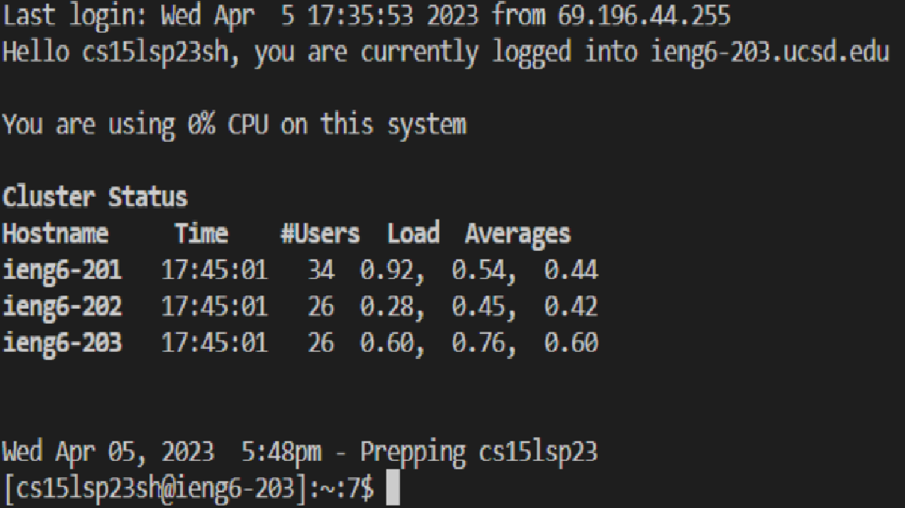
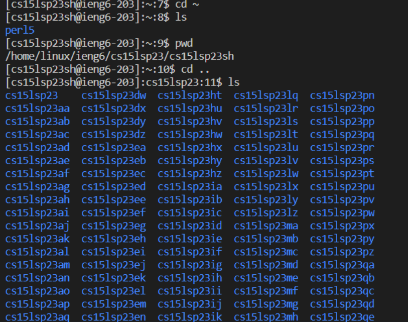

# Lab Report 1
* Go to [Link](https://code.visualstudio.com/download)
* Click the download link relevant to your device
* Open the downloaded file and proceed with installation steps, then open VSCode 
 
* Go to [Link](https://gitforwindows.org/)
* Click the download link to download git for your device, required for sshing into your server
* Open downloaded file and proceed with installation steps
* Go to [Link](https://stackoverflow.com/a/50527994) and follow steps to setup bash in VSCode
* Type `ssh cs15lsp23**@ieng6.ucsd.edu` in a bash terminal, enter yes to the prompt, then enter your password for the account (replace the ** in the ssh command with the letters specific to your username) 
 
* Now to try some commands, type `pwd` in the bash terminal, and it should display the current working directory
* type `ls` in the bash terminal, which will display folders and files in the current working directory
* try other commands such as `cat` which will print the contents of the current file or any files you include after cat, or `cd` which will change the directory according to what you include after cd
 
