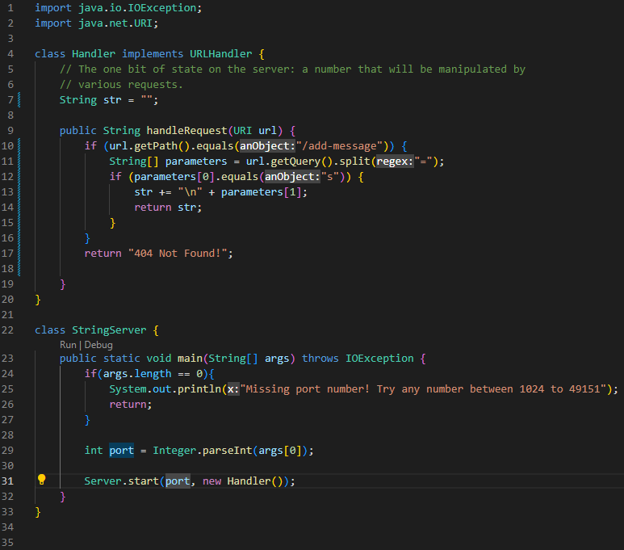

# Lab Report 2
**Part 1**



(code for StringServer)


* In the first screenshot, the handleRequest method in the Handler class is called
* The url entered is taken as the argument for the URI parameter of the method, and the String str is a relevant field
* In the first screenshot, the url path is /add-message which triggers the first if statement in handleRequest, and the query is split from the "=" into an "s" and another string "first try" into the String[] parameters array. That string (parameters[1]) is then concatenated to the String str after a new line using "\n" (before "", after "\nfirst try"). The String str is then returned.


* In the second screenshot, the handleRequest method in the Handler class is called
* The url entered is taken as the argument for the URI parameter of the method, and the String str is a relevant field
* In the second screenshot, the url path is /add-message which triggers the first if statement in handleRequest, and the query is split from the "=" into an "s" and another string "second try" into the String[] parameters array. That string (parameters[1]) is then concatenated to the String str after a new line using "\n" (before "\nfirst try", after 
* "\nfirst try\nsecond try"). The String str is then returned.

---
**Part 2**

**Using the averageWithoutLowest method in ArrayExamples:**

Failure inducing input:
```java
@Test
public void testErrorAWL(){
  double[] errorInput = {1.0,1.0,3.0,3.0};
  assertEquals(3.0, ArrayExamples.averageWithoutLowest(errorInput),0);
}
```

Non-failure inducing input:
```java
@Test
public void testNoErrorAWL(){
  double[] nonErrorInput = {2.0,4.0,6.0};
  assertEquals(5.0, ArrayExamples.averageWithoutLowest(nonErrorInput),0);
}
```

Symptom as output from running Junit tests:


The bug as before and after code:

(before)
```java
static double averageWithoutLowest(double[] arr) {
  if(arr.length < 2) { return 0.0; }
  double lowest = arr[0];
  for(double num: arr) {
    if(num < lowest) { lowest = num; }
  }
  double sum = 0;
  for(double num: arr) {
    if(num != lowest) { sum += num; }
  }
  return sum / (arr.length - 1);
}
```

(after)
```java
static double averageWithoutLowest(double[] arr) {
  if(arr.length < 2) { return 0.0; }
  double lowest = arr[0];
  for(double num: arr) {
    if(num < lowest) { lowest = num; }
  }
  double lowestCount = 0;
  double sum = 0;
  for(double num: arr) {
    if(num != lowest) { sum += num; }
    else {lowestCount += 1;}
  }
  return sum / (arr.length - lowestCount);
}
```

The bug was caused by the fact that the second for loop would reject all instances of the lowest value when adding to the sum, while the return statement only subtracted one from the total number of values, not accounting for multiple removed instances of the lowest value. As a result, the average was being calculated with an inaccurate number of values as long as there were multiple instances of the lowest value, hence the failure of the first test and not the second. By adding a count of the lowest values that increments by one whenever a value is rejected, the average is able to divide the sum by the total number of values minus the number of instances of the lowest value.

---
**Part 3**

Since the labs I have learned how to start a website locally as well as on the remote server. More than that, I have learned how to change the port when starting it, and how to make the website perform different actions depending on the path and queries in the url, none of which I knew how to do before.
