# Lab Report 3
This Lab Report is based on the command `find` in bash, using Windows syntax

---
**First Use**

Adding `-size` after the directory, then a numerical size preceeded by a + or - for less than or greater than, followed by a letter representing a unit of size such as M for megabytes, will search for all files either less than or greater than the provided size. I found this by asking ChatGPT for 4 ways to use the find command in bash.

(Example 1: Searching for files in technical/ that have a file size greater than 150 kilobytes, returns the 12 total files in technical that match the criterion)

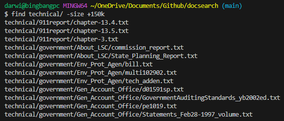

(Example 2: Searching for files in technical/ that have a file size less than 2 kilobytes, returns the 13 total files and directories that match the criterion)

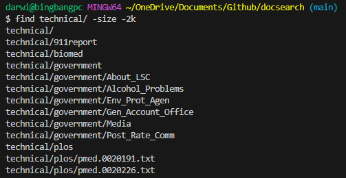

---
**Second Use**

Adding `-mtime` after the directory, then a number of days preceeded by a + or - for less than or greater than, followed by -print, will search for all files that have been edited either before or since the given number of days in the past. I found this by asking ChatGPT for 4 ways to use the find command in bash.

(Example 1: Searching for files that have been edited since 7 days ago in technical/ after I edited 3 of the files in technical/plos, returns the 3 files that match the criterion)

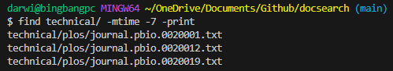

(Example 2: Searching for files that have been edited before 100 days ago in technical/, and considering that the files were only cloned onto the computer within the past month, returns nothing, since nothing matches that criterion)

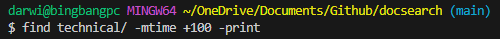

---
**Third Use**

Adding `-empty` after the directory will search for files and directories that are empty. I found this by asking ChatGPT for 4 more ways to use the find command in bash, for a total of 8 ways.

(Example 1: Searching for empty files and directories in technical/, and considering that there are no empty directories or files in the current state of technical/, returns nothing)

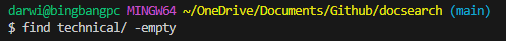

(Example 2: Searching for empty files and directories in technical/, though this time I created an empty directory in technical/ named emptyDir, so returns the one directory I just created that is empty)

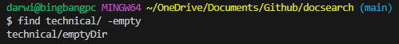

---
**Fourth Use**

Adding `-not` before the condition will specifically exclude results that meet the condition. I found this by asking ChatGPT what -not does in the find command in bash after seeing it used in one of the 8 provided ways to use find by ChatGPT.

(Example 1: Searching for all files and directories in technical/plos/ that are NOT .txt files, and considering that all the files in the directory are .txt besides the directory itself, only returns the directory)

(Example 2: Searching for all files and directories in technical/ edited NOT before 7 days ago, and considering I just edited 3 of the files in technical/ and created a directory in technical/, returns those 3 files and the directory)

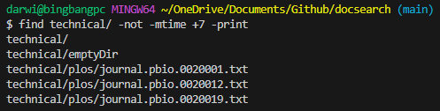

---
**ChatGPT**
(For all the listed prompts and outputs, I was using the provided information to learn and find ways to use the `find` command in bash, so I didn't directly use the output. I changed it by using it in my own commands in terminal)

First prompt given to ChatGPT: "4 different ways to use the find command in bash"

Output:

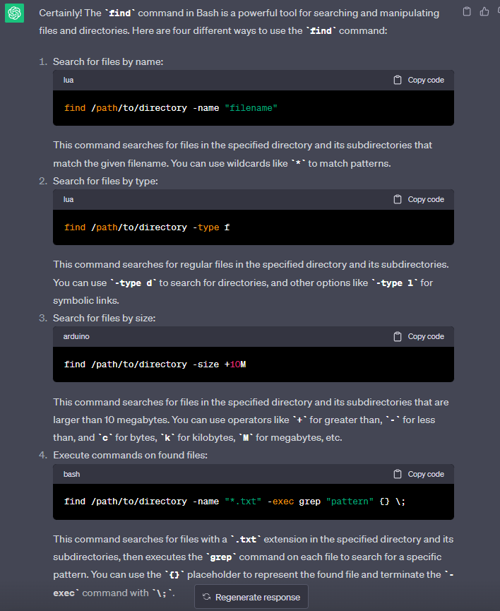

Second prompt given to ChatGPT: "more ways to use find"

Output:

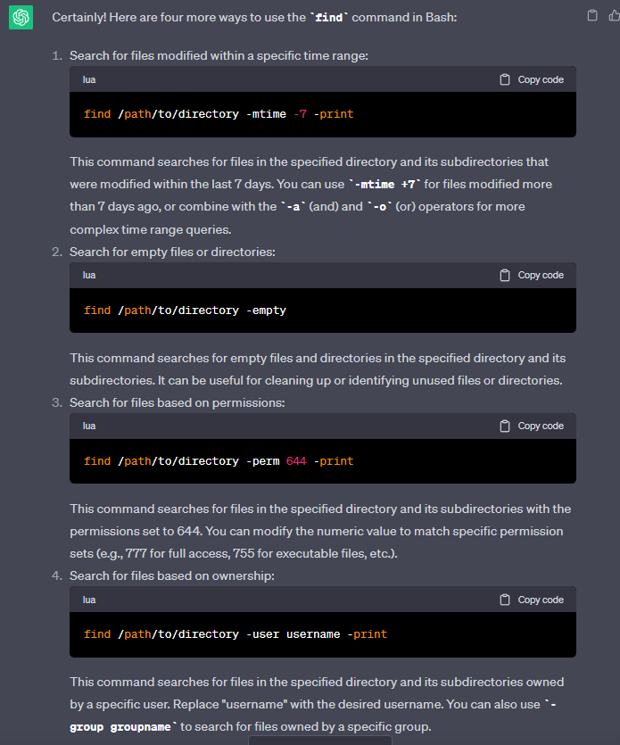

Third prompt given to ChatGPT: "more ways to use find"

Output:

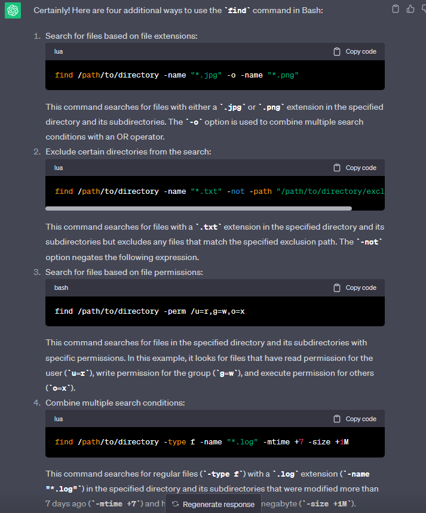

Fourth prompt given to ChatGPT: "what does -not do in find command in bash"

Output:

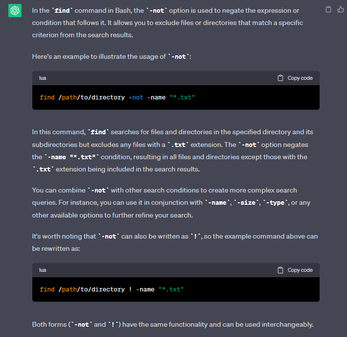
