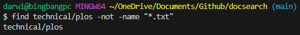

# Lab Report 3
This Lab Report is based on the command "find" in bash, using Windows syntax

---
**First Use**

Adding "-size" after the directory, then a numerical size preceeded by a + or - for less than or greater than, followed by a letter representing a unit of size such as M for megabytes, will search for all files either less than or greater than the provided size.

(Example 1 using greater than 150 kilobytes)

(Example 2 using less than 2 kilobytes)

---
**Second Use**

Adding "-mtime" after the directory, then a number of days preceeded by a + or - for less than or greater than, followed by -print, will search for all files that have been edited either before or since the given number of days in the past.

(Example 1 using since 7 days ago after I edited 3 of the files in technical/)

(Example 2 using before 100 days ago, considering that the files were only cloned onto the computer within the past month)

---
**Third Use**

Adding "-empty" after the directory will search for files and directories that are empty

(Example 1, considering that there are no empty directories or files in the current state of technical/)

(Example 2 after I created an empty directory in technical/ named emptyDir)

---
**Fourth Use**

Adding "-not" before the condition will specifically exclude results that meet the condition

(Example 1, considering that all the files in technical/plos/ are .txt files, besides the directory itself)

(Example 2 using not before 7 days ago, considering I just edited 3 of the files in technical/ and created a directory in technical/)

