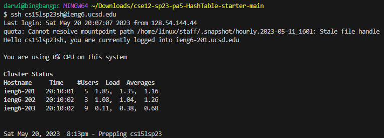
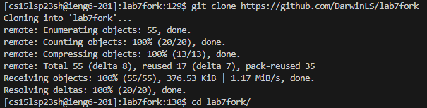
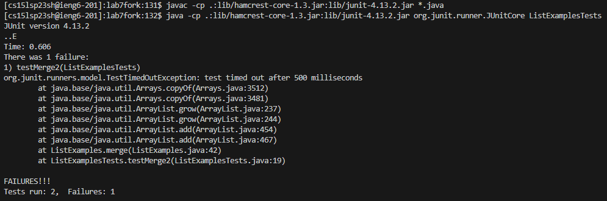
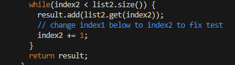
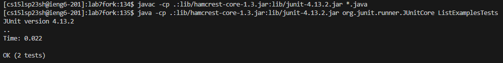
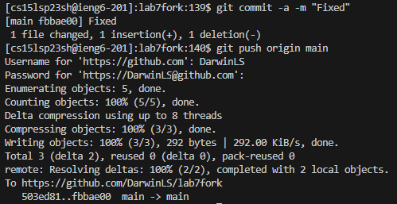

# Lab Report 4
Performed on a windows device

---

Keys Pressed: Typed `ssh cs15lsp23@ucsd.edu`, then `<enter>`, then typed my password, and then `<enter>`
`ssh cs15lsp23@ucsd.edu` allows me to log into and access the server and the first `<enter>` runs the command. The second `<enter>` enters my password.

---

Keys Pressed: Typed `git clone https://github.com/DarwinLS/lab7fork`, then `<enter>`, then typed `cd lab7fork/`, and then `<enter>`
`git clone https://github.com/DarwinLS/lab7fork` clones my fork of the repository into working directory of the server and `cd lab7fork/` moves the current working directory to the new directory of the repository. `<enter>` runs both commands.

---

Keys Pressed: Typed `javac -cp .:lib/hamcrest-core-1.3.jar:lib/junit-4.13.2.jar *.java`, then `<enter>`, then typed `java -cp .:lib/hamcrest-core-1.3.jar:lib/junit-4.13.2.jar org.junit.runner.JUnitCore ListExamplesTests`, and then `<enter>`
`javac -cp .:lib/hamcrest-core-1.3.jar:lib/junit-4.13.2.jar *.java` compiles the java files with the junit files and `java -cp .:lib/hamcrest-core-1.3.jar:lib/junit-4.13.2.jar org.junit.runner.JUnitCore ListExamplesTests` runs the ListExamplesTests. `<enter>` runs both commands.

---

Keys Pressed: Typed `vim ListExamples.java`, then `<enter>43jea<backspace>2<esc>:wq<enter>`
`vim ListExamples.java` opens the ListExamples.java files in vim to be edited. The first `<enter>` runs that command, `43j` goes down 43 lines to the line of the incorrect code, `e` goes to the end of the next word in the line which is `index1`, `a` enters insert mode on the next character, `<backspace>` deletes the 1, `2` types a 2 right after index, `:wq` saves and exits the editor, and the last `<enter>` runs `:wq`

---

Keys Pressed: `<up><up><up><enter>`, and then the same thing again.
`<up><up><up>` accesses `javac -cp .:lib/hamcrest-core-1.3.jar:lib/junit-4.13.2.jar *.java` since it was 3 up in the search history, and `<up><up><up>` the second time accesses `java -cp .:lib/hamcrest-core-1.3.jar:lib/junit-4.13.2.jar org.junit.runner.JUnitCore ListExamplesTests` since it was 3 up in the search history. `<enter>` in both instances runs the commands, respectively.

---

Keys Pressed: Typed `git commit -a -m "Fixed"`, then `<enter>`, then `git push origin main`, then `<enter>`, then typed my github username, then `<enter>`, then my password, and then `<enter>`
`git commit -a -m "Fixed"` makes a commit with all changed files and with the commit message in quotes, and `<enter>` runs the command. `git push origin main` pushes the commits to origin, and `<enter>` runs the command. The last two `<enter>` are used to enter my username and password.
