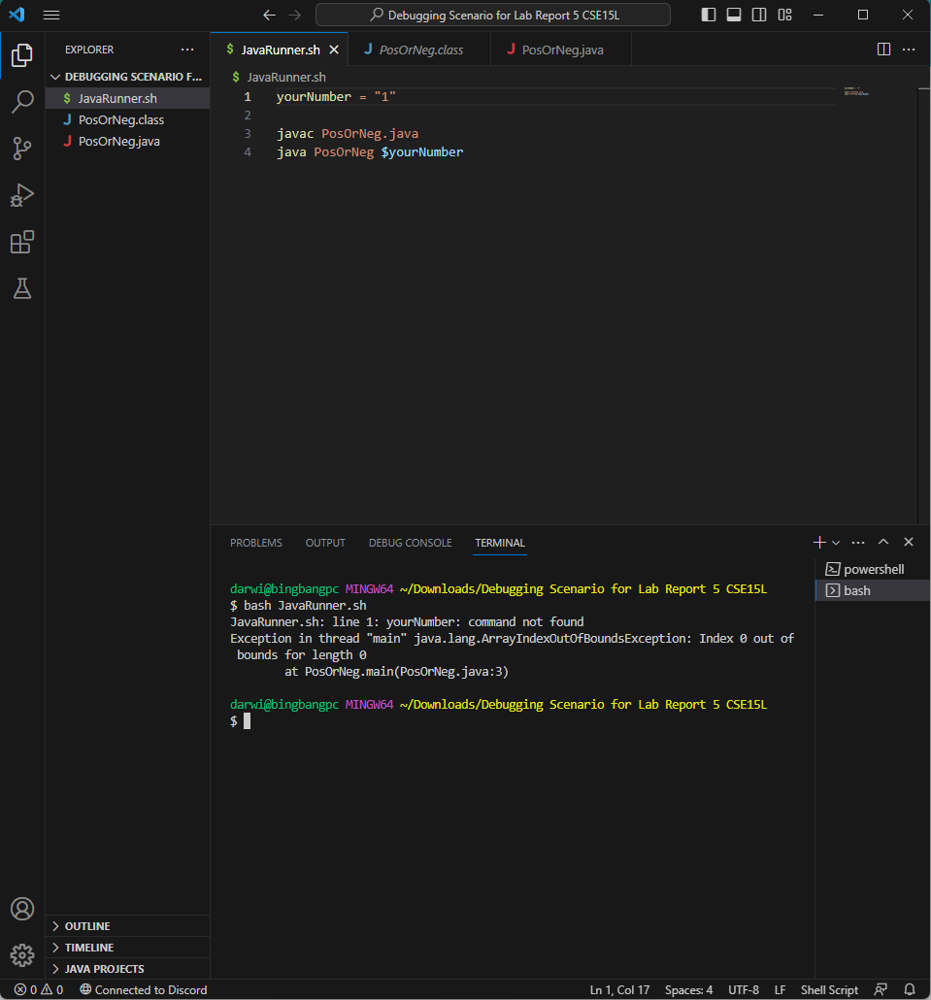

# Lab Report 5

**Student Initial Post**
What environment are you using (computer, operating system, web browser, terminal/editor, and so on)?
I am on a windows 11 desktop, using VSCode as my code editor

Detail the symptom you're seeing. Be specific; include both what you're seeing and what you expected to see instead. Screenshots are great, copy-pasted terminal output is also great. Avoid saying “it doesn't work”.
The script is supposed to compile and run the PosOrNeg.java file using a variable stored in the yourNumber variable in the bash script as a String argument, but for some reason storing the variable isnt working, instead saying it's an unrecognized command. I've attached a screenshot of my script.


Detail the failure-inducing input and context. That might mean any or all of the command you're running, a test case, command-line arguments, working directory, even the last few commands you ran. Do your best to provide as much context as you can.
The failure inducing input is the command `bash JavaRunner.sh`, and it is using 1 as the variable in the script to use as an arg when running the java file. I haven't run any previous commands, and the working directory is the the directory containing the script and java files. 

**TA Response**
If you pay close attention to a successful use of variables in a bash script, you will notice that there are no spaces between the variable name and the equals sign as well as the equals sign and the value to be assigned to the variable. Simple, but hard to notice. Unlike java, you cannot include spaces in those spots. Try removing the spaces, and see what happens.

**Student Response**
It worked after removing the spaces. I've attached a screenshot of the resulting output from running `bash JavaRunner.sh` with the change. The bug was indeed including spaces before and after the equals sign when creating the variable, as with spaces, the name of the variable was interpreted as a command.


**Information for Setup**
The full file and directory structure needed:


The content of JavaRunner.sh before fix:
```
yourNumber = "1"

javac PosOrNeg.java
java PosOrNeg $yourNumber
```

The content of PosOrNeg.java before fix:
```
public class PosOrNeg {
    public static void main(String[] args){
        if (Integer.parseInt(args[0]) < 0){
            System.out.println("Your number is negative");
        }
        if (Integer.parseInt(args[0]) > 0){
            System.out.println("Your number is positive");
        }
        else{System.out.println("Your number is 0");}
    }
}
```

To trigger the bug, open a git bash terminal, then run the command `bash JavaRunner.sh`

To fix the bug, remove the spaces before and after the equals sign in the first line of the script, where the variable is created.

---
**Reflection**

I've learned quite a bit this half a quarter. One of the most significant/memorable are how to create a basic autograder using a bash script with the necessary files. Another cool thing I learned was how to navigate files in VIM, though it wasn't the most fun.
